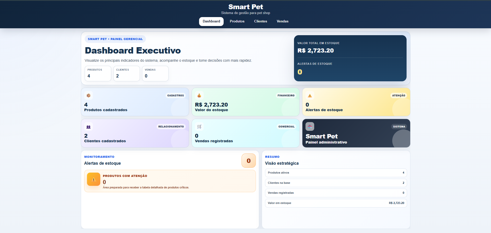

# Smart Pet - Java + Spring Boot + Angular


## Dashboard



Projeto refeito do zero com estrutura mais organizada.

## Estrutura

- `backend/` → API Spring Boot
- `frontend/` → aplicação Angular

## Backend

Requisitos:
- Java 17+
- Maven

Rodar:

```bash
cd backend
mvn spring-boot:run 
#ou#
/c/Users/"Paulo Rezende"/maven/apache-maven-3.9.14-bin/bin/mvn.cmd clean spring-boot:run -e
#ou#
C:\PROJETOS\smart-pet-v2\backend
& "C:\Users\Paulo Rezende\maven\apache-maven-3.9.14-bin\bin\mvn.cmd" spring-boot:run -e

#Compilar#
cd "C:\PROJETOS\smart-pet-v2\backend"
& "C:\Users\Paulo Rezende\maven\apache-maven-3.9.14-bin\bin\mvn.cmd" clean compile -e
#subir#
& "C:\Users\Paulo Rezende\maven\apache-maven-3.9.14-bin\bin\mvn.cmd" spring-boot:run -e
```

API: `http://localhost:8080`
H2 Console: `http://localhost:8080/h2-console`

## Frontend

Requisitos:
- Node.js 18+
- npm
- Angular CLI opcional

Rodar:

```bash
cd frontend
npm install
npm start

#ou#
cd /c/PROJETOS/smart-pet-v2/frontend
node -v
npm -v
npm install
npm start
```

Frontend: `http://localhost:4200`

## Módulos incluídos

- Dashboard
- Produtos
- Clientes
- Vendas/PDV
- Estoque
- Seed inicial de dados

## Observação

Esta versão foi reconstruída como uma base limpa. Ela prioriza organização e continuidade do projeto no novo stack.
